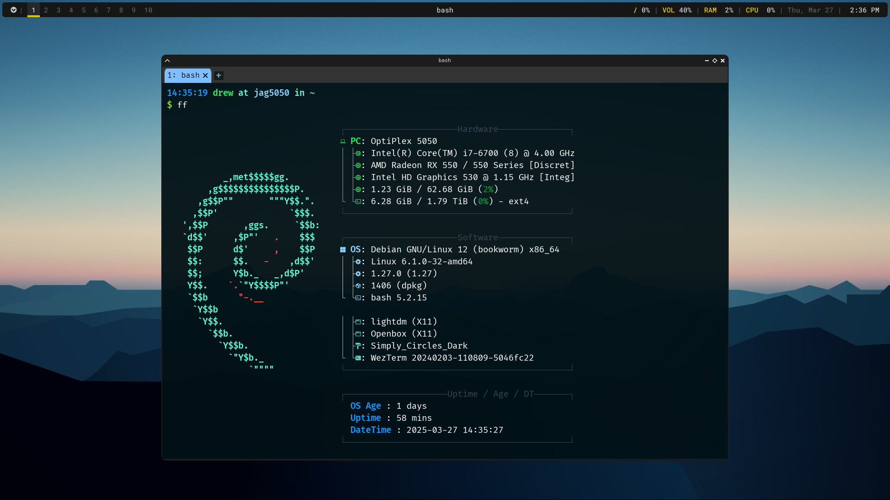

# 🪟 openbox-setup


A complete Openbox configuration script for Debian-based systems.
Includes a polished theme, smart automation, dynamic menus, and sane keybindings — fully set up in minutes.

> Part of the [JustAGuy Linux](https://codeberg.org/justaguylinux) window manager collection.



---

## 🚀 Installation

```bash
git clone https://codeberg.org/justaguylinux/openbox-setup.git
cd openbox-setup
chmod +x install.sh
./install.sh
```

This assumes a fresh Debian or Debian-based install with `sudo` access.

---

## 📦 What It Installs

| Component             | Purpose                           |
|------------------------|-----------------------------------|
| `openbox`              | Lightweight window manager        |
| `picom` `(yshui)`      | Compositor for transparency       |
| `polybar`              | Status bar                        |
| `wezterm`              | Terminal emulator (default)       |
| `tilix`                | Optional quake-style terminal     |
| `thunar` + `plugins`   | File manager                      |
| `xfce4-appfinder`      | Application launcher              |
| `firefox-esr`          | Default web browser               |
| `geany` + `plugins`    | Lightweight IDE                   |
| `dunst`                | Notifications                     |
| `rofi`                 | Launcher + keybind helper         |
| `nala`                 | Better apt frontend               |
| `fastfetch`            | System info utility               |
| `pipewire`             | Audio handling                    |
| `flameshot`,           | Screenshot tools                  |
| `micro`                | Terminal text editor              |
| `redshift`             | Night light                       |
| `qimgv`                | Lightweight image viewer          |
| `fzf`, etc.            | Utilities & enhancements          |
| `obmenu-generator`     | Dynamic right-click menu          |
| GTK & icon themes      | Cohesive look and feel            |

> 📄 _Need help with Geany? See the full guide at [justaguylinux.com/documentation/software/geany](https://justaguylinux.com/documentation/software/geany)_

---

## 🎨 Appearance & Theming

- **Openbox Theme:** `Simply_Circles_Dark` (included)
- **GTK Theme:** [Orchis](https://github.com/vinceliuice/Orchis-theme)
- **Icon Theme:** [Colloid](https://github.com/vinceliuice/Colloid-icon-theme)

> 💡 _Special thanks to [vinceliuice](https://github.com/vinceliuice) for the excellent GTK and icon themes._

---

## 🔑 Keybindings Overview

| Shortcut               | Action                                |
|------------------------|----------------------------------------|
| `Super + Enter`        | Launch terminal (WezTerm)             |
| `Super + Space`        | Launch XFCE app finder                |
| `Super + H`            | Open keybind help via Rofi            |
| `Super + Arrow Keys`   | Snap window to side/center            |
| `Super + 1–0`          | Switch to desktop                     |
| `Super + Shift + 1–0`  | Move window to desktop                |
| `Print`                | Screenshot via `maim`                 |
| `Super + Print`        | Screenshot via `flameshot`            |
| `XF86Audio*`           | Multimedia key support                |

Keybindings are defined in:

- `~/.config/openbox/rc.xml`
- `~/.config/openbox/scripts/keyhelper.sh` (invoked by `Super + H`)

---

## 📂 Configuration Files

```
~/.config/openbox/
├── rc.xml                 # Main Openbox configuration
├── autostart              # Startup applications
├── environment            # Session environment variables
├── menu.xml               # Static fallback menu
├── wallpaper/             # Default and user wallpapers
├── dunst/                 # Notification config
│   └── dunstrc
├── picom/                 # Compositor configuration
│   └── picom.conf
├── polybar/               # Panel bar setup
│   ├── config.ini
│   └── launch.sh
├── rofi/                  # Rofi launcher + keybind theme
│   ├── config.rasi
│   └── keybinds.rasi
├── scripts/               # Helper tools
│   ├── redshift-on
│   ├── redshift-off
│   └── help
└── obmenu-generator/      # Dynamic menu config
    └── schema.pl
    
~/.config/wezterm/
└── wezterm.lua              # Terminal configuration
```

---

## 🧠 Notes

- Menu is dynamically generated via `obmenu-generator -p -i`
- Wallpapers are stored in `~/.config/openbox/wallpaper/`
- You can launch a keybind viewer anytime with `Super + H`

---

## License

GPL-2.0 - See [LICENSE](LICENSE) for details.

## Support

<a href="https://www.buymeacoffee.com/justaguylinux" target="_blank"></a>

## Connect

- [YouTube](https://youtube.com/@justaguylinux)
- [Codeberg](https://codeberg.org/justaguylinux)
- [Discourse](https://lab.justaguylinux.com)
- [Matrix](https://matrix.to/#/#justaguylinux:matrix.org)
- [Wiki](https://justaguy.wiki)
- [Mastodon](https://fosstodon.org/@justaguylinux)

---

Made with butter by JustAGuyLinux
